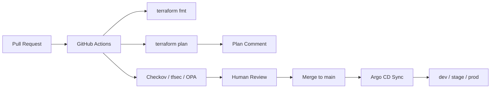

# Terraform GitOps Delivery Platform

[](https://github.com/mrsddq/terraform-gitops-delivery-platform/actions/workflows/ci.yml)

Multi-environment infrastructure delivery platform that shows how Terraform, GitHub Actions, policy checks, and Argo CD fit together in a real DevOps workflow.

## What This Builds

- `dev`, `stage`, and `prod` Terraform environments
- Reusable Terraform modules for network and application platform primitives
- Remote-state backend example with locking
- Pull request workflow for Terraform formatting, validation, plan summary, and security scans
- OPA policy examples for risky infrastructure changes
- Kustomize overlays for Kubernetes deployment promotion
- Argo CD Applications for environment-specific reconciliation

## Delivery Flow



## Repository Layout

```text
terraform/modules/        Reusable infrastructure modules
terraform/envs/           Environment root modules
kubernetes/base/          Shared Kubernetes manifests
kubernetes/overlays/      dev, stage, prod overlays
argocd/applications/      Environment-specific Argo CD Applications
policies/opa/             Policy-as-code examples
scripts/                  Plan comment rendering
tests/                    Static quality checks
```

## Local Validation

```bash
make validate
```

## Portfolio Evidence

See [docs/PORTFOLIO_EVIDENCE.md](docs/PORTFOLIO_EVIDENCE.md) for validation commands, sample plan-comment output, and review proof points.

## Production Docs

- [Architecture](docs/architecture.md)
- [Runbook](docs/runbook.md)
- [Incident response](docs/incident-response.md)
- [Cost estimate](docs/cost-estimate.md)
- [Security controls](docs/security-controls.md)

## Make Targets

```bash
make test
make lint
make local-demo ENV=dev
make security-scan
make deploy ENV=dev CONFIRM_DEPLOY=true
make destroy ENV=dev CONFIRM_DEPLOY=true
```

## Interview Story

This project demonstrates multi-environment Terraform delivery with CI validation, policy-as-code, plan review, environment overlays, GitOps promotion and production-style rollback discipline.

For Terraform formatting:

```bash
make fmt-check
```

## What This Proves

- Can design reusable Terraform without hiding environment differences
- Understands remote state, CI plan review, and policy-as-code gates
- Can map infrastructure delivery into GitOps deployment
- Knows how to structure promotion across `dev`, `stage`, and `prod`
- Documents the review and rollback model clearly

## Safe Demo Mode

The included CI checks do not require cloud credentials. `make local-demo ENV=dev` validates the Terraform, Kustomize and Argo CD wiring for an environment without creating infrastructure. Real plans should run in protected GitHub environments with OIDC-based AWS authentication.
