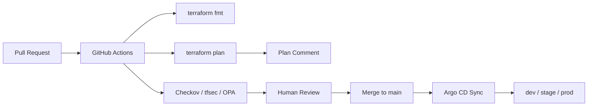

# Terraform GitOps Delivery Platform

[](https://github.com/mrsddq/terraform-gitops-delivery-platform/actions/workflows/ci.yml)

A cloud-independent reference for multi-environment Terraform and GitOps delivery. CI validates configuration and plan-summary behavior; it does not provision infrastructure or claim production deployment.

## What This Builds

- `dev`, `stage`, and `prod` Terraform environments
- Reusable Terraform modules for network and application platform primitives
- Remote-state backend example with locking
- Pull request workflow for Terraform formatting, structured GitOps checks, plan-summary regression tests, and advisory Checkov scans
- OPA policy examples for risky infrastructure changes
- Kustomize overlays for Kubernetes deployment promotion
- Argo CD Applications for environment-specific reconciliation

## Reference Delivery Flow

The diagram includes future cloud-authenticated plan/apply and OPA integration. Current CI runs formatting, local tests, all-environment routing checks, and an advisory Checkov scan; it does not run Terraform plans or OPA enforcement.


```mermaid
flowchart LR
    PR["Pull Request"] --> CI["GitHub Actions"]
    CI --> Fmt["terraform fmt"]
    CI --> Plan["terraform plan"]
    CI --> Scan["Checkov / tfsec / OPA"]
    Plan --> Comment["Plan Comment"]
    Scan --> Review["Human Review"]
    Review --> Merge["Merge to main"]
    Merge --> Argo["Argo CD Sync"]
    Argo --> Env["dev / stage / prod"]
```

## Repository Layout

```text
terraform/modules/        Reusable infrastructure modules
terraform/envs/           Environment root modules
kubernetes/base/          Shared Kubernetes manifests
kubernetes/overlays/      dev, stage, prod overlays
argocd/applications/      Environment-specific Argo CD Applications
policies/opa/             Policy-as-code examples
scripts/                  Plan comment rendering
tests/                    Static quality checks
```

## Local Validation

```bash
python -m pip install -r requirements-dev.txt
make validate
```

## Portfolio Evidence

See [docs/PORTFOLIO_EVIDENCE.md](docs/PORTFOLIO_EVIDENCE.md) for validation commands, sample plan-comment output, and review proof points.

## Production Docs

- [Architecture](docs/architecture.md)
- [Runbook](docs/runbook.md)
- [Incident response](docs/incident-response.md)
- [Cost estimate](docs/cost-estimate.md)
- [Security controls](docs/security-controls.md)

## Make Targets

```bash
make test
make lint
make local-demo ENV=dev
make security-scan
make deploy ENV=dev CONFIRM_DEPLOY=true
make destroy ENV=dev CONFIRM_DEPLOY=true
```

## Interview Story

This project demonstrates multi-environment Terraform delivery with CI validation, policy-as-code, plan review, environment overlays, GitOps promotion and production-style rollback discipline.

For Terraform formatting:

```bash
make fmt-check
```

## What This Proves

- Can design reusable Terraform without hiding environment differences
- Understands remote state, CI plan review, and policy-as-code gates
- Can map infrastructure delivery into GitOps deployment
- Knows how to structure promotion across `dev`, `stage`, and `prod`
- Documents the review and rollback model clearly

## Safe Demo Mode

The included CI checks do not require cloud credentials. `make local-demo ENV=dev` validates the Terraform, Kustomize and Argo CD wiring for an environment without creating infrastructure. Real plans should run in protected GitHub environments with OIDC-based AWS authentication.

## Validation boundaries

`make validate` parses YAML for every environment and rejects mismatched namespaces, incorrect repositories or overlay paths, and production automatic sync. Tests deliberately corrupt these settings to prove the checks fail. Production manual sync is a configuration default; GitHub/Argo CD approval permissions still require external setup.

The plan-summary CLI handles reads and both replacement orders, and exits with status 2 on malformed or unknown action sequences instead of displaying a misleading zero-change result. Feed it `terraform show -json plan.bin`; never commit a plan file because it can contain sensitive values.

```bash
terraform show -json plan.bin | python scripts/render_plan_comment.py
```

These checks do not validate provider behavior, render Kustomize, enforce OPA, or prove a running cluster. OPA files are examples pending integration; Checkov findings remain advisory.
