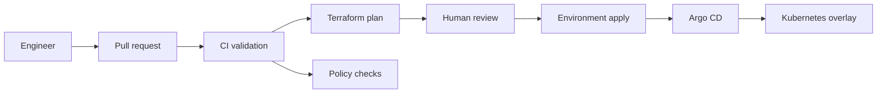
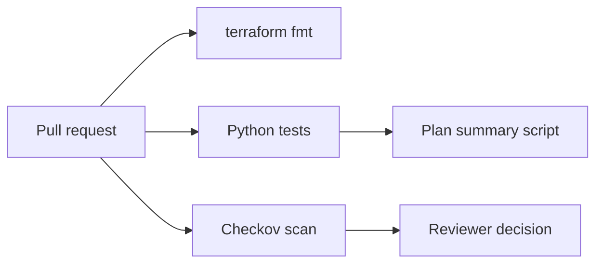
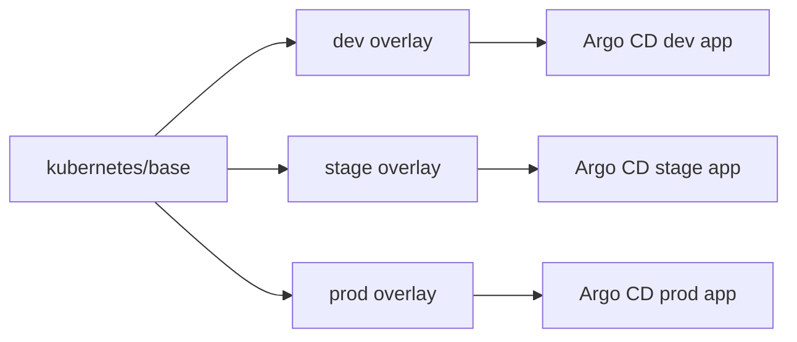
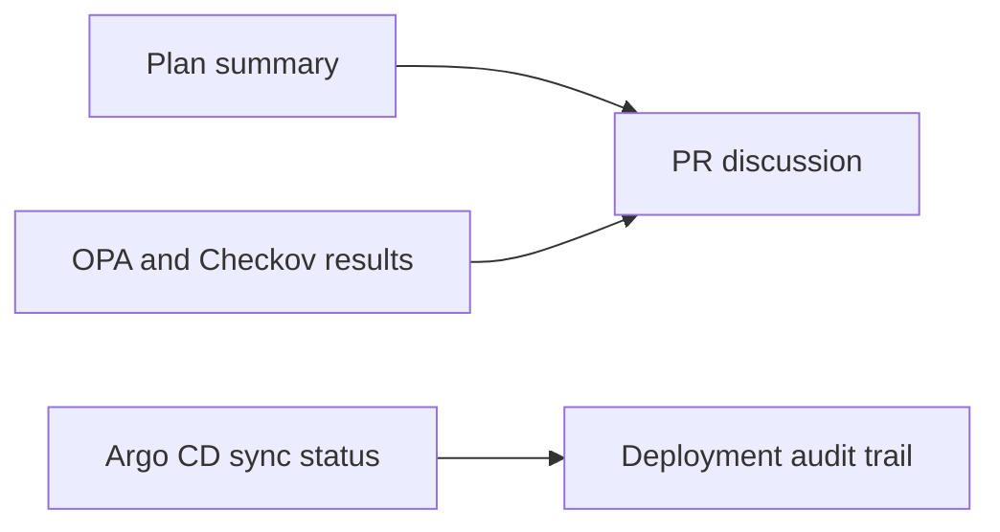

# Architecture

## High-Level Delivery Platform

```mermaid
flowchart LR
    Engineer["Engineer"] --> PR["Pull request"]
    PR --> CI["CI validation"]
    CI --> Plan["Terraform plan"]
    CI --> Policy["Policy checks"]
    Plan --> Review["Human review"]
    Review --> Apply["Environment apply"]
    Apply --> Argo["Argo CD"]
    Argo --> K8s["Kubernetes overlay"]
```

## CI/CD Flow

```mermaid
flowchart LR
    PR["Pull request"] --> Fmt["terraform fmt"]
    PR --> Tests["Python tests"]
    PR --> Checkov["Checkov scan"]
    Tests --> Comment["Plan summary script"]
    Checkov --> Review["Reviewer decision"]
```

## Kubernetes Deployment Flow

```mermaid
flowchart LR
    Base["kubernetes/base"] --> Dev["dev overlay"]
    Base --> Stage["stage overlay"]
    Base --> Prod["prod overlay"]
    Dev --> ArgoDev["Argo CD dev app"]
    Stage --> ArgoStage["Argo CD stage app"]
    Prod --> ArgoProd["Argo CD prod app"]
```

## Observability And Audit Flow

```mermaid
flowchart LR
    Plan["Plan summary"] --> PR["PR discussion"]
    Policy["OPA and Checkov results"] --> PR
    Argo["Argo CD sync status"] --> Audit["Deployment audit trail"]
```
